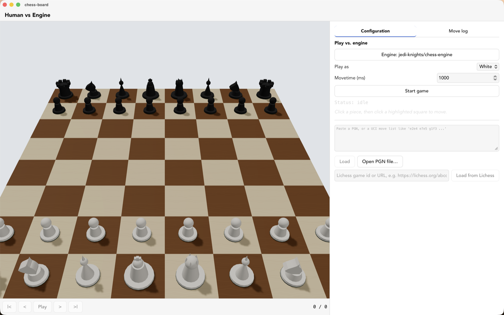
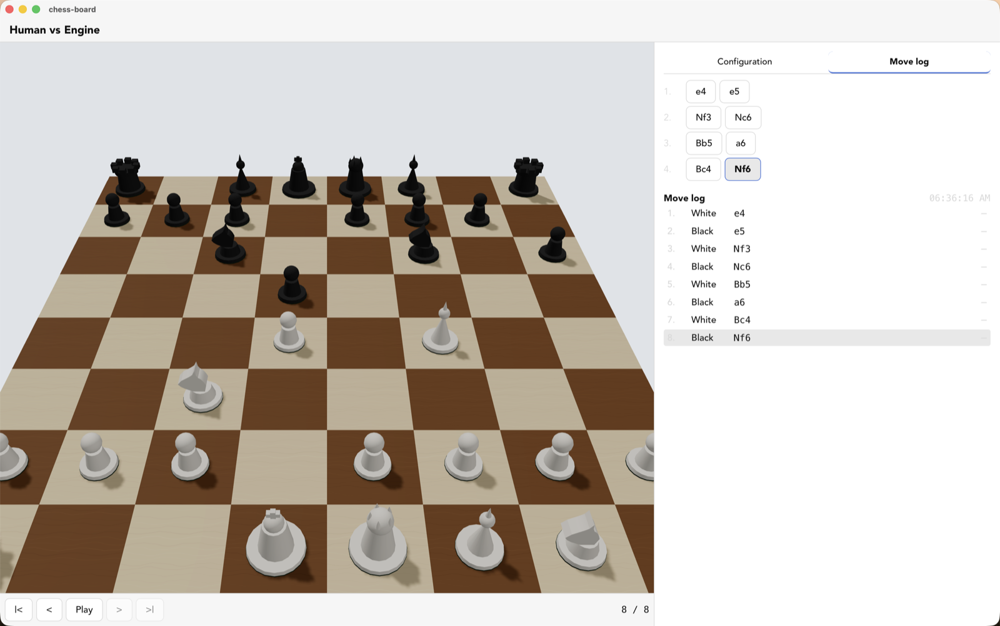

# chess-board

A Tauri + Three.js desktop app for visualizing and stepping through chess games move by move — built for people writing their own UCI chess engines.

[](https://github.com/jedi-knights/chess-board/actions/workflows/ci.yml)
[](https://github.com/jedi-knights/chess-board/actions/workflows/badge.yaml)
[](https://github.com/jedi-knights/chess-board/actions/workflows/release.yml)
[](https://jedi-knights.github.io/chess-board/?v=42)
[](LICENSE)

<p align="center">
  
  
</p>

<p align="center">
  <a href="#features">Features</a> ·
  <a href="#requirements">Requirements</a> ·
  <a href="#installation">Installation</a> ·
  <a href="#usage">Usage</a> ·
  <a href="#examples">Examples</a> ·
  <a href="#configuration">Configuration</a> ·
  <a href="#development">Development</a> ·
  <a href="#contributing">Contributing</a>
</p>

## Overview

If you're building your own UCI engine — like [jedi-knights/chess-engine](https://github.com/jedi-knights/chess-engine) — you already have a way to talk to it: pipe `position startpos` / `go depth 8` into its stdin and read `info`/`bestmove` lines back out, or point a tournament GUI (Arena, Cute Chess, ChessBase) at the binary and let it run full matches. Both are exactly right for what they're built for.

Neither is built for the moment you actually need most during development: your engine just played something wrong at ply 23 of a 40-move game, and you want to *see* the position, not reconstruct it in your head from a FEN string or a scrollback full of `bestmove` lines. Tournament GUIs assume a finished, trustworthy opponent engine running a full match — they're heavyweight for "let me just look at this one position." Reading a raw UCI move list or FEN and mentally rendering an 8x8 board, square by square, is exactly the kind of manual step where transposition bugs, off-by-one castling rights, and misread en passant squares hide in plain sight.

**chess-board** closes that gap two ways: paste in whatever your engine already produces — a raw UCI move list straight from a `position ... moves e2e4 e7e5 ...` log line, or a full PGN — and step through it ply by ply on an actual rendered board, in 2D or 3D. Or point it straight at your engine binary and play a live game against it, clicking moves on the board instead of typing UCI by hand.

```text
Paste:  e2e4 e7e5 g1f3 b8c6 f1b5 a7a6
Get:    a board you can step through one ply at a time, forward or back,
        in either a top-down 2D view or an angled 3D view — no mental
        FEN parsing required.

Or:     point chess-board at your engine binary, choose a side, and
        click pieces to play a full game against it directly.
```

## Features

- **One Three.js scene, 2D and 3D from a single camera toggle** — no duplicated rendering path between the two views. Defaults to 3D, and orients toward whichever side you're playing (your own pieces render closer to you, both in the top-down 2D view and the angled 3D one).
- **Pieces slide, not snap** — a single step forward or back (your move, the engine's reply, an autoplay tick, the `<`/`>` buttons) animates the moved piece; bigger jumps (`|<`, `>|`, jumping to a distant move, loading a new game) snap instantly.
- **Selectable board color palettes** (Classic, Forest, Ocean, Slate), persisted across restarts, independent of the light/dark app theme.
- **Check and checkmate get a visual ring** around the checked king — orange and pulsing for check, red and faster for checkmate.
- **Load a game three ways**: paste a PGN, paste a bare UCI move list (`e2e4 e7e5 g1f3 ...`), or use the native "Open PGN file…" dialog.
- **Step through ply by ply** — forward/back buttons, jump to start/end, autoplay, or click any move directly in the move list to jump to it.
- **Move log transcript** with a live wall clock and, when the source PGN carries lichess/chess.com-style `%clk` or ICC-style `%emt` annotations, how long each side took on each move.
- **Play a live game against any UCI engine** — choose an engine binary, pick a side, click a piece to see its legal destinations highlighted, click one to move. The engine replies automatically; no manual UCI typing.
- **Remembers your last engine** across restarts, and labels it with a GitHub-style `owner/repo` identifier (e.g. `jedi-knights/chess-engine`) instead of a raw file path — the label also makes clear whether that engine is just selected or actually running.
- **Crash messages include the engine's own stderr output**, not just "exited unexpectedly" — and clicking **Stop** actually dismisses a displayed error instead of leaving it stuck.
- **Search history panel** — every `info` line from the engine's current search (one per completed depth), not just the latest, so you can see how a search actually converged.
- **Engine option controls** — whatever `option` lines an engine advertises after the UCI handshake (checkboxes, spin/combo/string fields, buttons) render as real controls instead of being silently ignored.
- **Light / dark theme** — follows the OS by default, with a manual override that persists across restarts.
- **Engine-agnostic by design** — the move model is driven by standard PGN/UCI notation, and live play spawns whatever binary you point it at — not tied to any one engine.

## Requirements

- **Rust** with `cargo`/`rustc` (any recent stable toolchain — Tauri's own requirement)
- **Node.js** `^20.19.0` or `>=22.12.0`, plus [`pnpm`](https://pnpm.io/) `10.x`
- macOS or Linux with the usual [Tauri v2 system prerequisites](https://v2.tauri.app/start/prerequisites/) (Xcode command line tools on macOS; `libwebkit2gtk-4.1-dev` + friends on Linux) — Windows should work but is untested here

## Installation

```bash
git clone https://github.com/jedi-knights/chess-board.git
cd chess-board
pnpm install
```

## Usage

```bash
pnpm tauri dev
```

This opens the app window.

**To replay a game:** paste a PGN or a bare UCI move list into the text box, click **Load**, then use the playback controls under the board — `|<` `<` `Play/Pause` `>` `>|` — or click any move in the move list to jump straight to it.

**To play against an engine:** click **Choose engine binary…** and pick your compiled UCI engine (chess-board remembers this choice across restarts, so you only need to do this once per engine), choose **Play as** White or Black, optionally adjust **Movetime (ms)**, then **Start game**. Click one of your pieces — its legal destination squares highlight — then click a highlighted square to move. The engine replies on its own; watch the **Status** line for its depth/score while it's thinking.

**To play on Lichess** (Board API): switch to **Play on Lichess** in the View menu's Game Mode group. Click **Sign in with Lichess** to authorize via OAuth (opens a browser tab, catches the callback on a loopback port), or paste a Lichess personal-access token with the `board:play` scope into the **human slot** field. Either way, the resulting token is stored in your OS keychain and never leaves the app. Then pick one of four ways to start a game:

- **Seek an opponent** — posts an open seek to Lichess's real-time lobby; auto-connects when someone accepts.
- **Challenge a user** — challenge a specific Lichess account by name.
- **Play the Lichess AI** — challenge Stockfish at level 1–8.
- **Join a game by id** — fallback for when a game or challenge already exists on lichess.org and you want to play it here.

Which color you play is derived from the game's own white/black ids compared against your verified account — no manual "Play as" picker. The token is stored in the OS keychain, never in the app. chess-board verifies the token against `GET /api/account` — a BOT-titled account is refused here (put it in the Bot slot below instead).

**To bridge a UCI engine to Lichess** (Bot API): switch to **Engine vs Lichess** in the same menu, paste a token from a Lichess account you have dedicated to running engines into the **bot slot** field. If that account is not yet a BOT, chess-board shows an **Upgrade to Bot account** panel — the upgrade is irreversible on Lichess's side. Pick your engine binary, click **Start listening for challenges**, and any challenge that arrives is auto-accepted and played by the engine. The two token slots are entirely separate: a token in the human slot cannot post through the Bot API and vice versa.

Toggle **View: 2D / View: 3D** in the header to switch camera modes, and **Theme** to cycle system → light → dark.

## Examples

**1. Replay a finished game.** Paste a PGN — even a short one:

```text
1. f3 e5 2. g4 Qh4#
```

Click **Load** and step forward twice; the board reaches checkmate on Black's queen delivering `Qh4#`. Useful as a quick sanity check that PGN parsing and board rendering agree with each other before trusting the tool with your own engine's games.

**2. Debug your own engine's move list directly.** Copy the move sequence straight out of your engine's `position startpos moves ...` log line and paste it as-is:

```text
e2e4 e7e5 g1f3 b8c6 f1b5 a7a6
```

No PGN formatting needed — chess-board applies each UCI move in order and shows you the resulting position. **Gotcha:** a bare move list carries no timing information, so every row in the move log shows `—` instead of a think-time.

**3. Inspect think-time from a real lichess/chess.com export.** PGNs downloaded from lichess or chess.com annotate each move with a `%clk` comment:

```text
[TimeControl "180+2"]

1. e4 {[%clk 0:03:00]} 1... e5 {[%clk 0:02:58]} 2. Nf3 {[%clk 0:02:55]} *
```

The move log now shows how long each side took per move, derived from the clock deltas and the game's own time control. **Gotcha:** this is only as accurate as the source annotations — a PGN with no `%clk`/`%emt` comments (like the one in Example 1) always shows `—`.

**4. Play a live game against your own engine.** Build your UCI engine (e.g. `jedi-knights/chess-engine`'s `make` produces `./engine`), then in chess-board: **Choose engine binary…** → select that compiled binary → **Play as** White → **Start game**. Click a pawn, click one of its highlighted destination squares — the engine replies within your configured movetime, and the move log/board update automatically. **Gotcha:** the engine process is spawned directly (no shell involved), so point the picker at the actual compiled binary, not a shell script or `make` target.

**5. Toggle an engine option mid-session.** `jedi-knights/chess-engine` advertises two options after the UCI handshake: `UseNNUE` (checkbox) and `EvalFile` (path). Once you've started that engine, the **Engine options** panel shows both — set `EvalFile` to the path of a `.jnn1` network, then check `UseNNUE`, and its next move uses the neural-net evaluation instead of the classical one. **Gotcha:** order matters for this specific engine (set `EvalFile` before checking `UseNNUE`) — chess-board sends whatever you change, in the order you change it, with no per-engine sequencing logic of its own.

## Configuration

No environment variables or config files. Two things worth knowing about what the app can touch on your machine:

| Setting | Value | Why |
|---|---|---|
| Content-Security-Policy | Set explicitly in `src-tauri/tauri.conf.json` (`default-src 'self'`, no remote script/style sources) | The webview can't load arbitrary remote content |
| File-read scope | `src-tauri/capabilities/default.json` grants read access only under `$HOME`, `$DOCUMENT`, `$DOWNLOAD`, `$DESKTOP` — not the whole filesystem | The "Open PGN file…" dialog can only read files under your common user directories |
| Engine process spawning | **No** `shell:execute` capability is granted. `engine_start` (`src-tauri/src/engine.rs`) spawns the picked binary directly via `std::process::Command`, after checking the path is a real file | The engine path is arbitrary and chosen at runtime through the same native file dialog used for opening PGNs — that dialog is the trust boundary, not a pre-declared shell allowlist (which the `shell` plugin's capability model isn't built for anyway) |
| Debug log | A plain-text `debug.log` in your OS's app log directory (e.g. `~/Library/Logs/com.jediknights.chessboard/debug.log` on macOS) — engine spawn/exit events (including captured stderr) from Rust, plus move/failure events from the frontend | Gives enough of a timeline to debug a crash after the fact, without needing DevTools open at the time. Cleared on every app launch and every "Start game" click, so it never grows across a long session |
| Lichess tokens | Two separate OS-keychain entries — `lichess-human-token` for Play-on-Lichess (your regular account) and `lichess-bot-token` for Engine-vs-Lichess (a dedicated BOT account). Never persisted in the frontend store. Service name `com.jediknights.chessboard` on every platform | A BOT account can never make a human's moves and a human account can never post through the Bot API — Rust verifies each token's `title == "BOT"` on first use per slot and refuses cross-slot mismatches |

## Development

```bash
pnpm install        # install frontend dependencies
pnpm tauri dev       # run the app with hot reload
pnpm exec tsc --noEmit  # typecheck
pnpm test            # run the chess-rules test suite (Vitest)
pnpm test:coverage   # same, with an LCOV coverage report in coverage/
pnpm build           # typecheck + production frontend build
pnpm tauri build     # full desktop app bundle
(cd src-tauri && cargo test)  # engine.rs's process-lifecycle unit tests
```

### Releasing

Push a `v*` tag (e.g. `v0.1.1`) to publish a universal macOS build (Intel + Apple Silicon) as a GitHub Release — see `.github/workflows/release.yml`. The build is signed with a real Apple Developer ID certificate and notarized (see `docs/macos-code-signing.md` for the six `APPLE_*` secrets this requires and how to (re)generate them), so installing is a normal double-click with no Gatekeeper prompt.

```bash
git tag v0.1.1
git push origin v0.1.1
```

To rebuild an existing tag's release (e.g. after a failed run), trigger the workflow manually from the Actions tab or via `gh workflow run release.yml -f tag=v0.1.1`.

### Layout

```
src/
  App.tsx / App.css       top-level layout, wires state to components
  components/
    BoardScene.tsx        the Three.js scene — camera-mode ("2d"|"3d") toggle,
                          shared square/piece meshes for both views
    Piece.tsx             one piece mesh; composed-primitive geometry per
                          piece type (see CLAUDE.md's hard requirements)
    MoveList.tsx          compact numbered SAN grid, click-to-jump
    MoveLog.tsx           chronological transcript + per-move think-time
    MoveHighlights.tsx    selected-square + legal-destination overlays,
                          plus a pulsing check/checkmate ring on the king
    PlaybackControls.tsx  step/play/pause/jump-to-start/end + autoplay
    GameLoader.tsx        paste-PGN / paste-UCI / "Open PGN file…" /
                          "Load from Lichess" — disabled while any live
                          session is running
    EngineControls.tsx    Human-vs-Engine mode: choose binary, pick side,
                          movetime, start/stop a live game
    EngineVsEngineControls.tsx  Engine-vs-Engine mode: two engine slots,
                          both spawn and play against each other
    LichessControls.tsx   Human-vs-Lichess mode: Board API — currently
                          paste a game id after saving a personal-access
                          token
    LichessBotControls.tsx  Engine-vs-Lichess mode: Bot API — listen for
                          challenges on a BOT-account token, run a local
                          engine as the response
    EngineOptions.tsx     one control per UCI `option` the engine
                          advertised — rendered only when some side is
                          engine-controlled
    AnalysisPanel.tsx     scrolling history of the current search's
                          `info` lines — same gate as EngineOptions
    WallClock.tsx         live current-time display in the move log header
  hooks/
    useAppliedTheme.ts    resolves system/light/dark and applies it
    useViewMenu.ts        wires the native View menu to the app's stores;
                          locks the game-mode group while any live
                          session is running
  lib/
    chessRules.ts         the only seam that touches chess.js: PGN/UCI
                          parsing, FEN-per-ply, think-time derivation,
                          legal-move lookup, game-over detection
    uci.ts                the only seam that parses/builds UCI protocol
                          lines (bestmove/info in, position/go out) —
                          src-tauri never parses UCI, see Configuration
    lichess.ts            the only seam that parses Lichess's NDJSON
                          shapes — move-stream lines and account events;
                          src-tauri never parses these, same reasoning
    boardGeometry.ts      algebraic square <-> 3D world coordinates
    time.ts               duration/clock formatting
    engineIdentifier.ts   path -> "owner/repo"-style label for the UI
    boardPalettes.ts      Classic/Forest/Ocean/Slate square colors
    pieceStyles.ts        Classic/Modern-low-poly piece rendering styles
    pieceGlyphs.ts        Unicode chess-glyph canvas textures (2D mode)
    woodTexture.ts        procedural wood-grain board-square texture
  state/
    gameStore.ts          loaded/live game, current ply, camera mode,
                          controllers/pov, click-to-move selection state
    engineStore.ts        per-side engine store factory (white/black),
                          UCI handshake and turn orchestration; selected
                          path + movetime persist across restarts
    lichessStore.ts       Human-vs-Lichess: Board API game stream,
                          human move submission
    lichessBotStore.ts    Engine-vs-Lichess: Bot API event stream,
                          challenge accept, engine move submission
    gameModeStore.ts      persisted game-mode preset (which of the four
                          mode panels the sidebar renders)
    themeStore.ts         persisted light/dark theme preference
    boardThemeStore.ts    persisted board palette choice
    pieceStyleStore.ts    persisted piece style choice
src-tauri/
  src/lib.rs              Tauri Builder + fs/dialog/opener plugins,
                          engine/Lichess state slots, menu setup
  src/engine.rs           spawns/stops the UCI engine process, pipes its
                          stdout as events — no UCI parsing here, see above
  src/lichess.rs          Lichess HTTP client and NDJSON stream pumper;
                          validates game ids, moves, usernames; no
                          protocol parsing (same boundary as engine.rs)
  src/menu.rs             native menu bar (View menu items + game-mode
                          radio group)
  src/debug_log.rs        on-disk debug log, cleared per session/game
  capabilities/default.json  scoped permissions (see Configuration)
  tauri.conf.json         explicit CSP
```

All chess rules and PGN/UCI parsing live in `src/lib/chessRules.ts`, wrapping [`chess.js`](https://github.com/jhlywa/chess.js). Tests in `chessRules.test.ts` exercise it entirely through its exported functions — no reaching into `chess.js` internals — so the suite survives refactors of how the wrapper is implemented, not just what it currently calls.

## Contributing

Contributions welcome — fork, branch, and open a PR. Engine spawning, live play, a search-history panel, engine option controls, move animation, and board palettes (see Features) are done; the natural next things to pick up (each as its own PR) are:

1. **GLTF piece models** — needs an actual model asset; not something to fabricate a source for. Point the project at one you have rights to use.
2. **Drag-and-drop moves** as an alternative to click-to-select-then-click-destination, once there's a concrete reason the click flow falls short.

If you're working on a UCI engine of your own and this tool is missing something you need to debug it, that's exactly the kind of issue/PR this project wants.

## License

MIT — see [LICENSE](LICENSE).
